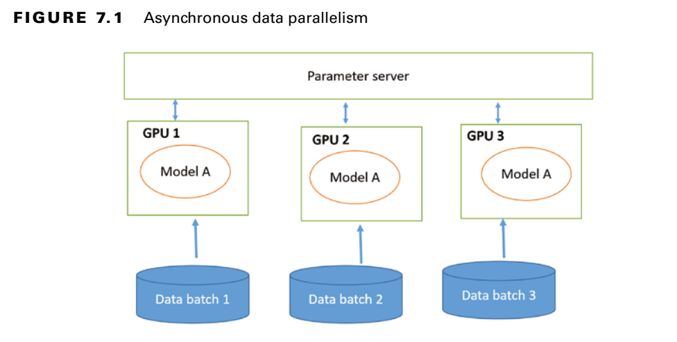
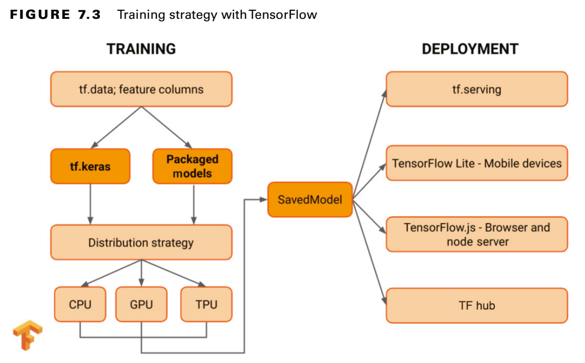

# Parallelism

There are 2 types of parallelism:
1. Data parallelism
2. Model parallelism

## Data Parallelism

- This distributes the data over multiple nodes (GPU's). 
- Every GPU has the entire model.

This is done using 2 ways:

1. Synchoronous
2. Asynchronous

### Synchronous

- Every part does the forward pass at the same time. 

- Synchronous training uses an [all-reduce algorithm](https://towardsdatascience.com/visual-intuition-on-ring-allreduce-for-distributed-deep-learning-d1f34b4911da) which collects all the trainable parameters from various workers and accelerators.

The “all-reduce sync” strategy is great for Tensor Processing Unit (TPU) and one-machine multi-GPUs.

### Asynchronous

- Harder to scale
- Nodes dont wait for each other
- Variables are synched asynchronously
- An example:

 This is the parameter server strategy for TensorFlow distributed learning

## Model Parallelism

- Used when the model is too big for 1 node/GPU
- A subset of layers are given to each node. Example: ResNet50 (has 50 layers) trained on 10 GPU's will have 5 layers per GPU.
- Nodes have to wait for output from previous node. 

#### Distributed training strategies using TensorFlow

| Strategy                    | Description                                                                                                         |
| --------------------------- | ------------------------------------------------------------------------------------------------------------------- |
| MirroredStrategy            | Synchronous distributed training on multiple GPUs on one machine.                                                   |
| CentralStorageStrategy      | Synchronous training but no mirroring.                                                                              |
| MultiWorkerMirroredStrategy | Synchronous distributed training across multiple workers, each with potentially multiple GPUs or multiple machines. |
| TPUStrategy                 | Synchronous distributed training on multiple TPU cores.                                                             |
| ParameterServerStrategy     | Some machines are designated as workers and some as parameter servers.                                              |

#### Training strategy with TensorFlow

