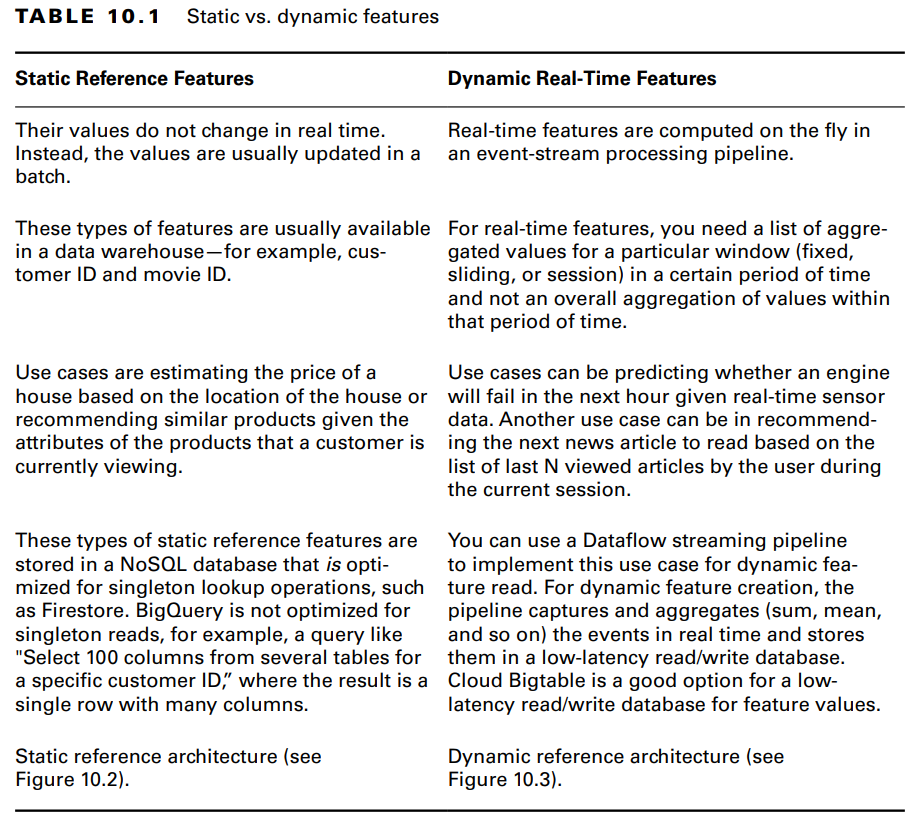
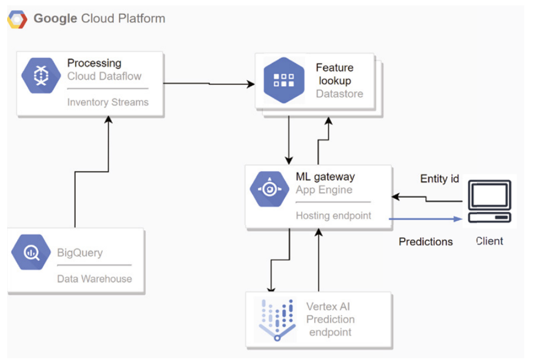
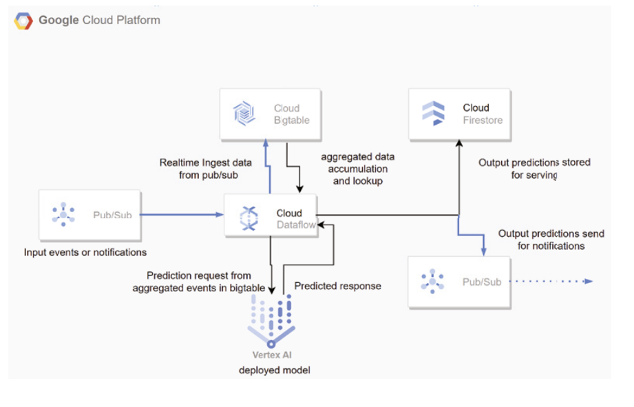
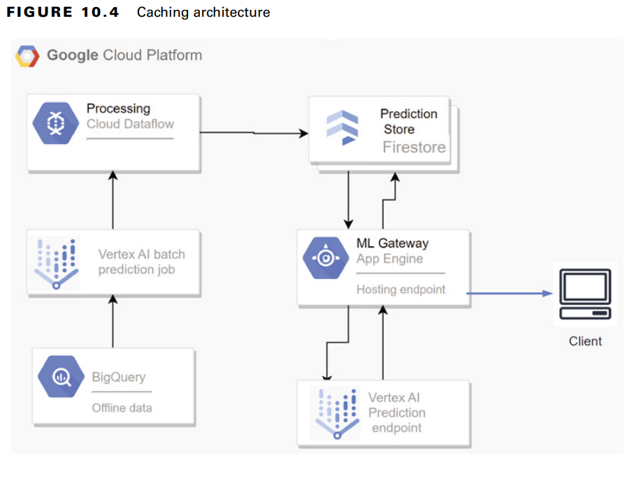

# Serving

Achieved using [Tensorflow Serving](services/tensorflow-serving)

### Types of Input Features

### Some Pipelines
#### Static Reference Architecture

#### Dynamic Reference Architecture

#### Caching Architecture
The process works like this: 
1. Data is ingested, processed, and stored in a key-value store. 
2. A trained and deployed model runs a batch prediction job on the prepared data to produce predictions for the input data. Each prediction is identified by a key. 
3. A data pipeline exports the predictions referenced by a key to a low-latency data store that’s optimized for singleton reads. 
4. A client sends a prediction request referenced by a unique key. 
5. The ML gateway reads from the data store using the entry key and returns the corresponding prediction. The client receives the prediction response.

Here the prediction requests can be of 2 types:
- For a specific entity
	- can be single id like customer_id, device_id, or a combination of input features
	- if too many entities, use hybrid approach. Pre-compute top N entities and use online prediction for rest of the entities
- For an anonymous or guest user
	- create a hashed combination of all possible input features and use it as key while prediction is the value

#### A/B Testing
available through [Vertex AI](services/vertex-ai.md)
