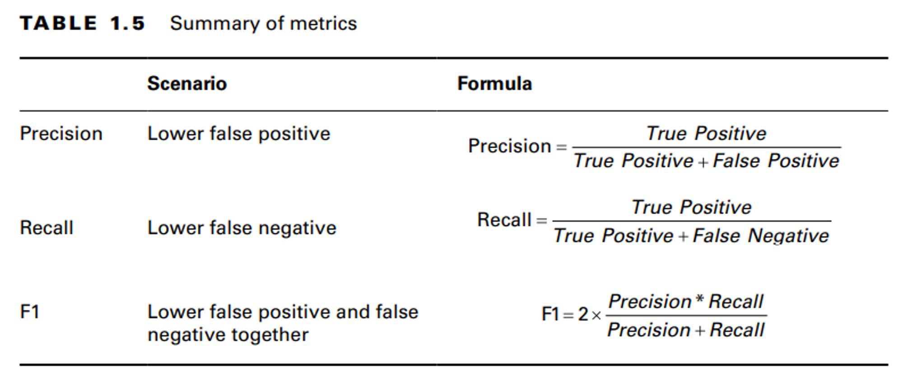
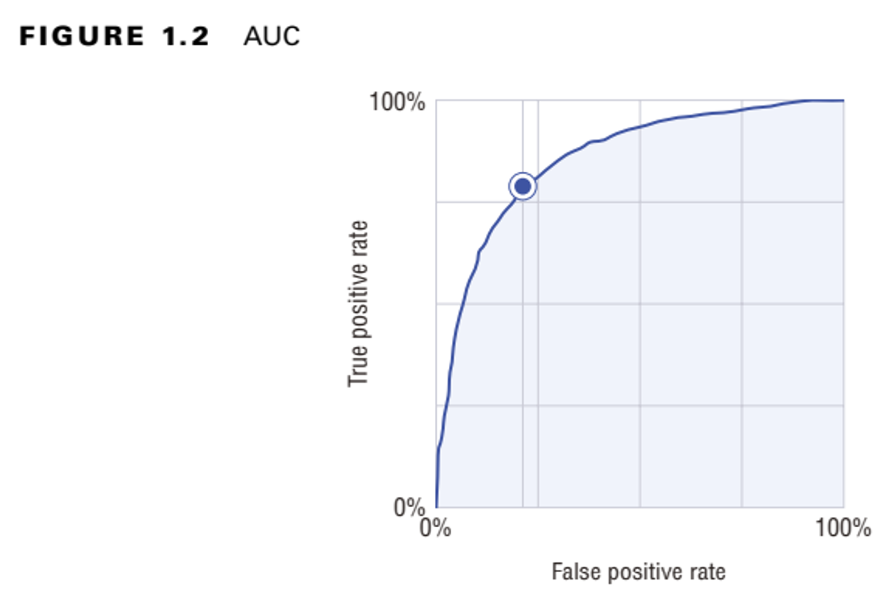

# Metrics
---

## Classification
---

**Precision**: Answers the question - "Of all the instances predicted as positive (TP + FP), how many are actually positive?"
**Recall**: Answers the question - "Of all the actual positive instances (TP + FN), how many did the model correctly identify as positive?"
**Specificity**: Answers the question - "Of all the actual negative instances (TN + FP), how many did the model correctly identify as negative?"

### AUC

**True Positive Rate (TPR):** How well the model identifies the positive class.

**False Positive Rate (FPR)**: How often there are incorrect classifications of the positive class.

This method has the following advantages:

- Scale-invariant: It measures how well the predictions are ranked and not their absolute values.
- Classification threshold-invariant: It helps you measure the model irrespective of what threshold is chosen.
  
	- Classification threshold invariance is not always desirable because sometimes there are huge disparities between false positives and false negatives. Therefore, AUC is not usually the best metric for picking a model when there is class imbalance.

The ideal point is the top left corner with 100% TPR which is never achieved. The further away from diagonals the better.

If two models are considered, 2 graphs are plotted and the area under the curve is used to compare. After the choice, you can find the threshold point that maximizes your F1.

### AUC PR Curve

If the dataset is highly imbalanced, the AUC PR is preferred because a high number of true negatives can cause the AUC curve to be skewed.

Ideal point is top right which has 100% recall and precision.

Best curve is a horizontal line across the top.

**Resources**
1. [A Beginner Comprehensive Understanding of Precision, Recall, and F1 Score: Demystifying Key Metrics in Machine Learning Evaluation | by Han HELOIR, Ph.D. ☕️ | Data And Beyond | Medium](https://medium.com/data-and-beyond/a-beginner-comprehensive-understanding-of-precision-recall-and-f1-score-demystifying-key-metrics-58cb3a2619e)
2. [A Beginner’s Guide to ROC Curves and AUC Metrics. | by Michael Scognamiglio | The Startup | Medium](https://medium.com/swlh/a-beginners-guide-to-roc-and-auc-curves-d279c1a5e0e6)

## Regression
---

### MAE
Mean Absolute Error

### RMSE
Root Mean Squared Error

If you are worried that your model might incorrectly predict a very large value and want to penalize the model, you can use this.

Ranges from 0 to infinity.

### RMSLE
Root Mean Squared Logarithmic Error

It uses the natural logarithm of the predicted and actual values +1

This is an asymmetric metric, which penalizes under prediction (value predicted is lower than actual) rather than over prediction.

### MAPE
Mean Absolute Percentage Error

You would choose MAPE when you care about proportional difference between actual and predicted value.

### $R^2$
Square of the Pearson correlation coefficient (r) between the labels and predicted values

Ranges from zero to one

A higher value indicates a better fit for the model