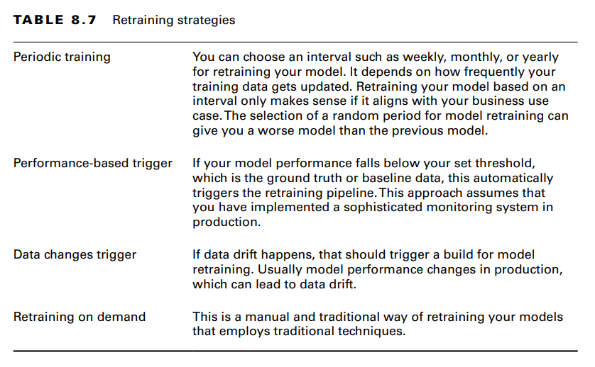

# Monitoring

## Data Drift

- is a change in the statistical distribution of the data

Example:
- you built a model which uses temperatures in fahrenheit. The unit has now changed to celsius

To detect:
	- checking feature distribution 
	- correlation between features
	- checking data schema

## Concept Drift

- is when the statistical properties of the target variable have changed over time.

Example:
- you build a model to predict sentiment based on reddit feed. public opinion on a certain event can change from positive to negative over time.

To detect:
- monitor model

## When to retrain

