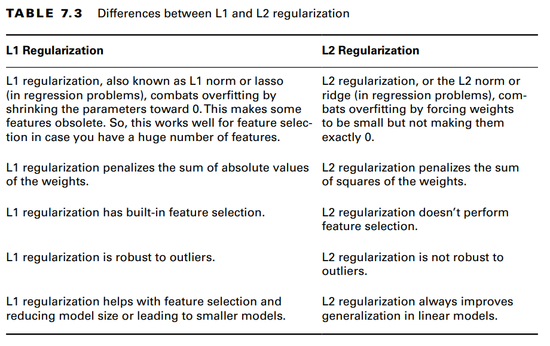

# Regularization

- Tunes the loss function by adding a penalty term that prevents excessive fluctuation of the coefficients

- Reduces the chances of overfitting.

There are 2 types:
1. L1 Regularization: Use when you are trying to reduce features
2. L2 Regularization: Use when you are looking for a stable model

