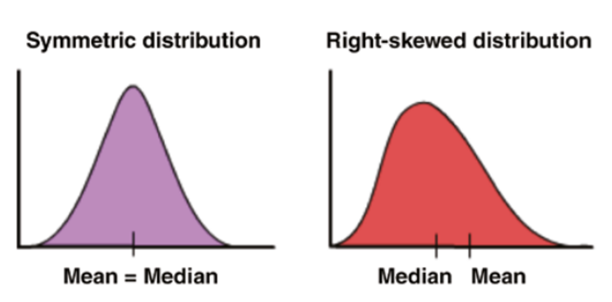

# Statistics

### Mean
- use when no outliers

### Median
- use when outliers are present
- if odd, median is middle value
- if even, avg of middle values

### Mode
- used if there is an outlier and the majority of the data is the same
- most occurring value

### Standard Deviation
- $SD = \sqrt{Variance}$
- used to identify outliers
- Data points that lie more than one standard deviation from the mean can be considered unusual

### Covariance
Covariance is a measure of how much two random variables vary from each other

$$
Cov(X, Y) = \frac{\sum (x_i - \bar{x})(y_i - \bar{y})}{N}
$$

### Correlation
- a normalized form of covariance
- ranges -1 to +1
- aka pearsons correlation coefficient
- helpful in detecting label leakage

### Data Skew
- when the normal distribution curve is not symmetric

### Z-Score
Scaled value = (value − mean) / stddev

### Bias and Variance

#### Bias
Basically MSE

Describes how well the model matches the training data set:

- A model with a higher bias would not match the data set closely.
- A low bias model will closely match the training data set.
  
Characteristics of a high bias model include:

- Failure to capture proper data trends
- Potential towards underfitting
- More generalized/overly simplified
- High error rate

#### Variance

$$
Var(X) = \frac{\sum (x_i - \bar{x})^2}{N-1} = \sigma^2
$$

Simply stated, variance is the variability in the model prediction—how much the ML function can adjust depending on the given data set. 
Variance comes from highly complex models with a large number of features.

Characteristics of a high variance model include:

- Noise in the data set
- Potential towards overfitting
- Complex models
- Trying to put all data points as close as possible

#### Bias-Variance Trade-Off
$$
Bias \propto \frac{1}{Variance}
$$

- Models with high bias will have low variance.
- Models with high variance will have a low bias.

The better a model fits the data, the lower the bias, the higher the variance

Ways to find optimal solution:
- Increasing the complexity of the model 
- Increasing the training data set (preferred) (works well with $\uparrow bias \uparrow variance$ models)

This table lists common algorithms and their expected behavior regarding bias and variance:

| **Algorithm**     | **Bias**  | **Variance**                                        |
| ----------------- | --------- | --------------------------------------------------- |
| Linear Regression | High Bias | Less Variance                                       |
| Decision Tree     | Low Bias  | High Variance                                       |
| Bagging           | Low Bias  | High Variance (Less than Decision Tree)             |
| Random Forest     | Low Bias  | High Variance (Less than Decision Tree and Bagging) |

