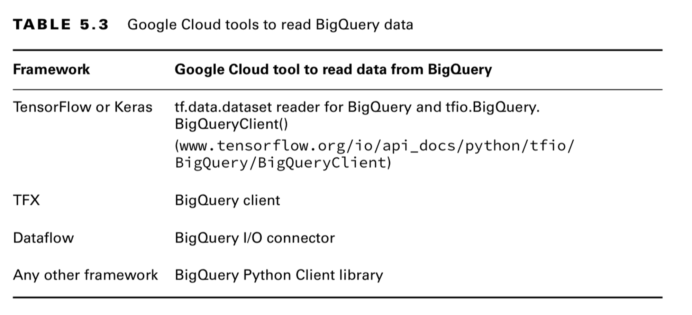

# BigQuery
## BigQuery ML

#### Tools to read BigQuery data

## BigQuery Data Transfer Service

use this service to transfer data from following sources:

- Data warehouses (teradata, amazon redshift)
- External cloud provider amazon s3
- Google SaaS apps like [Cloud Storage](cloud-storage.md), Google Ads, etc

after a one-time config, automatically loads data on a regular basis