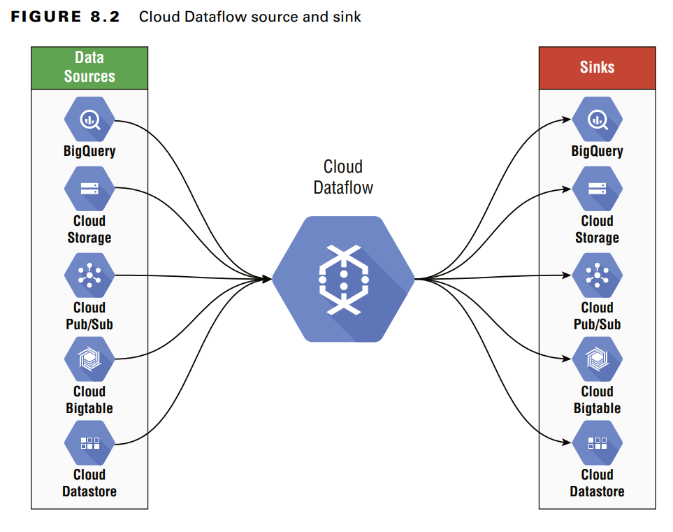

# Dataflow

- serverless
- fully managed
- data processing/ETL service
- processes streaming and batch data

Dataflows are processing pipelines
You can:
- monitor their execution
- transform data
- analyze data
- do many Hadoop workloads easily and be more maintainable

Example:
process and transform data from [Pub/Sub](pub-sub) to [BigQuery](bigquery) using Dataflow