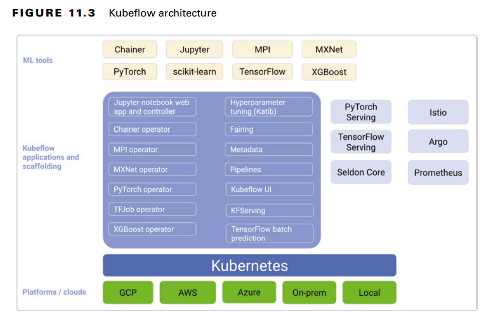

# Kubeflow
the ML toolkit for Kubernetes

## Kubeflow Pipelines

is a platform to build, deploy, and manage multistep ML workflows based on Docker containers

is the only choice that comes with an experiment tracking feature

contains:
- UI for managing and tracking the experiments, jobs and runs
- an engine for scheduling multistep ML workflows
- An SDK for pipelines and components
- Notebooks for interacting with system using SDK
- Orchestration, experimentation and reuse

### CI/CD

The pipelines can be invoked using following services:

- On a schedule, you can use [Cloud Scheduler](cloud-scheduler.md) 
- Responding to an event, you can use [Pub/Sub](pub-sub.md) and [Cloud Functions](cloud-function). For example, the event can be the availability of new data files in a Cloud Storage bucket. 
- As part of a bigger data and process workflow, you can use [Cloud Composer](cloud-composer) or [Cloud Data Fusion](data-fusion). 
- Kubeflow Pipelines also provides a built-in scheduler, **Argo**, for recurring pipelines in Kubeflow Pipelines. 
- As an alternative to using [Cloud Build](cloud-build), you can use other build systems such as Jenkins. 
- You can use [Apache Airflow](apache-airflow) for general-purpose workflows, which you can run using the fully managed [Cloud Composer](cloud-composer) service. 