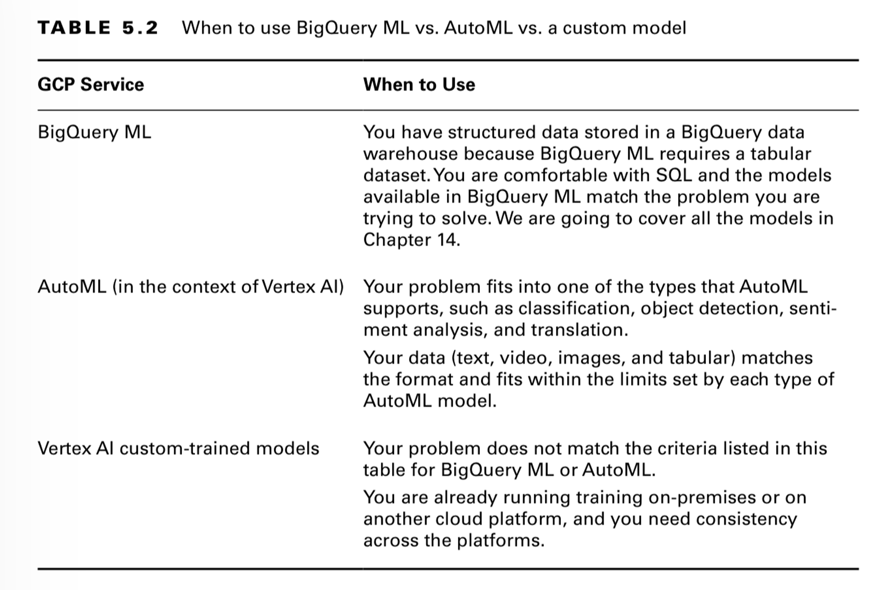

# Multi-service Notes

#### ML workflow to GCP services mapping

#### [BigQuery](bigquery.md) vs [AutoML](AutoML) vs [VertexAI](services/vertex-ai) custom Model

#### [Memorystore](memorystore.md) vs [Datastore](datastore.md) vs [Bigtable](bigtable.md)

#### Storage guidance

If using TensorFlow:
- store data as sharded TFRecord files. 
- can also use TF I/O to manage data in Parquet format for training. 

Else:
- store as Avro files in [Google Cloud Storage](cloud-storage.md)

