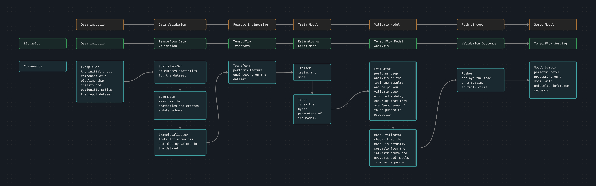

# TFX

is Google's production-scale ML platform

for building and managing ML workflows in prod env

provides:
- TFX pipelines let you orchestrate your ML workflow on several platforms, such as Apache Airflow, Apache Beam, and Kubeflow Pipelines.
- TFX provides components that you can use as a part of a pipeline or as a part of your ML training script.
- TFX provides libraries, which provide the base functionality for many of the standard components. TFX includes both libraries and pipeline components. 

## TFX Pipelines, libraries and components

TFX pipeline can orchestrates using any of the following:
- [Kubeflow Pipelines](kubeflow.md#Kubeflow%20%Pipelines) running on GKE
- [Apache Airflow](apache-airflow.md) or [Cloud Composer](cloud-composer.md)
- [Vertex AI Pipelines](vertex.md#Vertex%20%AI%20%Pipelines)

