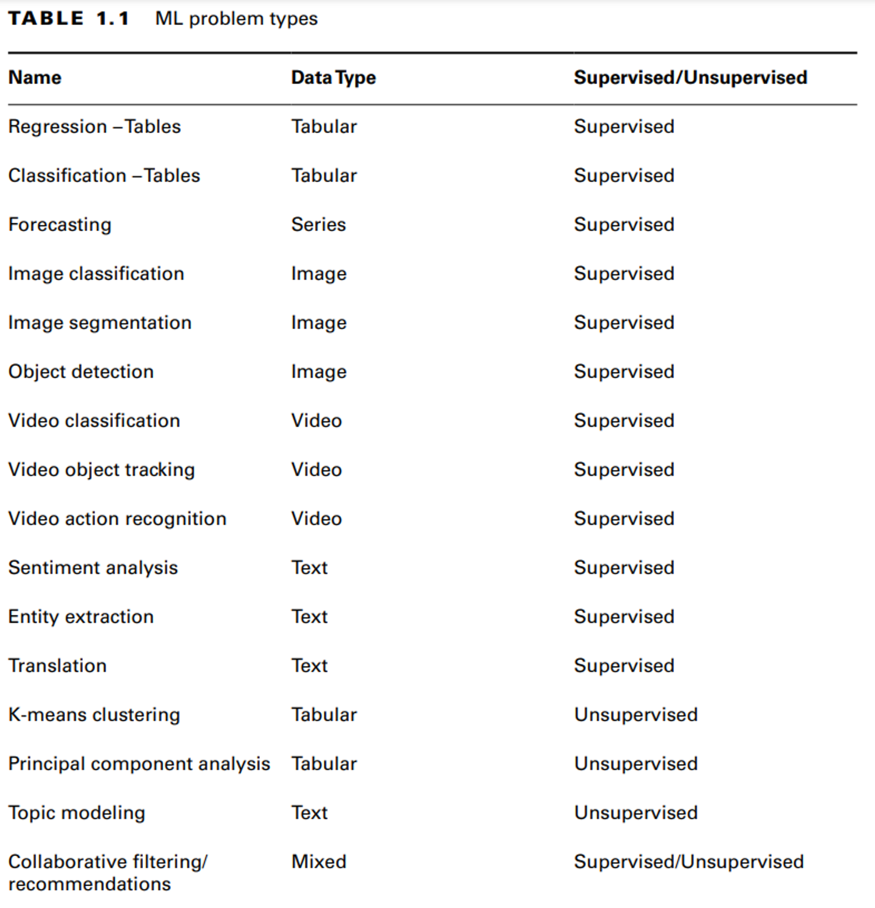
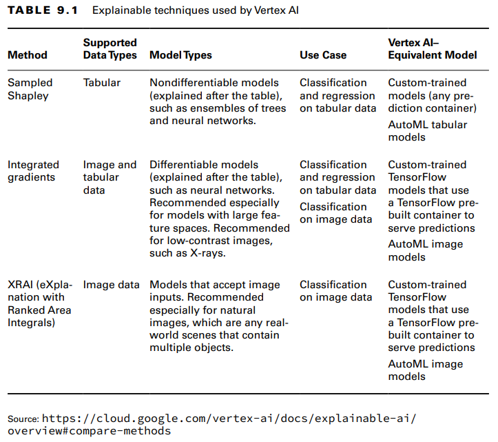
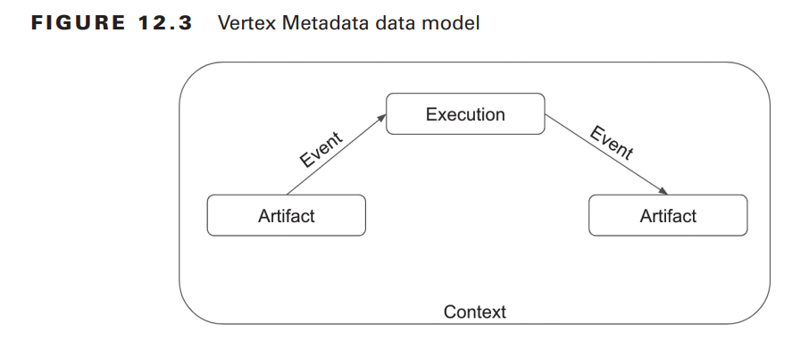

# Everything Vertex
## Vertex AI
### ML problem types available in Google Cloud

### User-managed vs Managed Notebook

| Managed notebook                                                                                                                                 | User-managed notebook                                                                                                                                                                                                          |
| ------------------------------------------------------------------------------------------------------------------------------------------------ | ------------------------------------------------------------------------------------------------------------------------------------------------------------------------------------------------------------------------------ |
| Automated shutdown for idle instances                                                                                                            | - Not supported out of the box. - Can create a monitor to see when instances are idle using Cloud Monitoring and Cloud Functions and shut them down when not in use.                                                        |
| UI integration with Cloud Storage and BigQuery: - Available from within JupyterLab’s navigation menu                                          | UI integration with Cloud Storage and BigQuery:  - There is no UI integration. - Can use the BigQuery connector - Can also use the BigQuery magic (\%%) command  For Cloud Storage - Can use gsutil commands |
| Automated notebook runs                                                                                                                          | - This feature is not supported - Can use Cloud Scheduler to schedule the training jobs or the notebook.                                                                                                                    |
| Custom containers: You can add your own custom container images to a managed notebook Jupyter instance.                                          | Custom containers: You have the choice to add custom containers.                                                                                                                                                               |
| Dataproc or Serverless Spark integration                                                                                                         | This feature is not supported.                                                                                                                                                                                                 |
| Frameworks: You can choose any framework supported once you have created a managed notebook.                                                     | Frameworks: You have the choice to create only one framework from all the supported frameworks                                                                                                                                 |
| Network and security:  - You can run this in the VPC in the same project.  - Shared VPC control is not yet supported for managed notebooks | Network and security:  - You can use VPC Service Controls to set up a user-managed notebooks instance within a service perimeter and implement other built-in networking and security features.                             |

## Vertex AI Vizier

- optimization service to tune hyperparameters
- Doesnt have a known objective function and is too costly to evaluate using one
- can optimize other tasks as well

Example use case:
- Optimize LR, Batch Size, etc
- Optimize usability of an application by testing different arrangements of UI elements
- Minimizing computing resources by identifying ideal buffer size and thread count
- Optimize amount of ingredients in a recipe to produce the most delicious version

The Vizier is an independent service. Hyperparameter tuning for custom training is a built-in feature that uses Vertex AI Vizier.

## Vertex [Explainable AI](ml-topics/explainable-ai)

The following services are supported:
- AutoML image models (classification only)
- AutoML tabular models (classification and regression only)
- Custom TF models on image data
- Custom TF models on tabular data

### Feature Attribution

is done using three methods:
1. Sampled Shapley
2. Integrated Gradients
	1. provides local feature importance
	2. doesnt provide global feature importance
	3. doesnt explain feature interactions and combinations
4. XRAI (eXplanation with Ranked Area Integrals)

#### Differentiable Models
All operations in the model are differentiable. Ex: Neural Networks
Preferred Method: Integrated Gradients
#### Non-Differentiable Models
The models that include non-differentiable operations like rounding or decoding.
Example: An ensemble of Neural Network and Decision Tree.
Preferred Method: Sampled Shapley

### Explanations available after configuration

- Online Explanations
	- Synchronous requests to the Vertex AI API. Similar to online predictions
	- Returns predictions with feature attribution
- Batch Explanations
	- Asynchronous requests. 
- Local Kernel Explanations
	- For custom trained models. 

## Vertex AI Pipelines

can use this to run [Kubeflow Pipelines](kubeflow.md#Kubeflow%20Pipelines) or Tensorflow Extended pipelines

serverless

provides [data lineage](ml-topics/lineage.md)

## ML Metadata

terminology used:
- #### Metadata store
	- top-level container for all metadata resources
	- usually, 1 metadata is shared by entire org
- #### Metadata resources
	- ##### Artifacts
		- is an entity or piece of data that was created or can be used by an ML workflow
	- ##### Context
		- group of artifacts and executions
		- you are optimizing hyperparameters; each experiment would be a different execution with its own set of parameters and metrics. You can group these experiments into a context and then compare the metrics in this context to identify the best model.
	- ##### Execution
		- represents a step in ML workflow
		- 
	- ##### Events
		- connects artifacts and executions
	- ##### MetaDataSchema
		- schema which is used by particular datatypes like artifact or execution
		- represented using OpenAPI schema objects in YAML format
## Model Registry